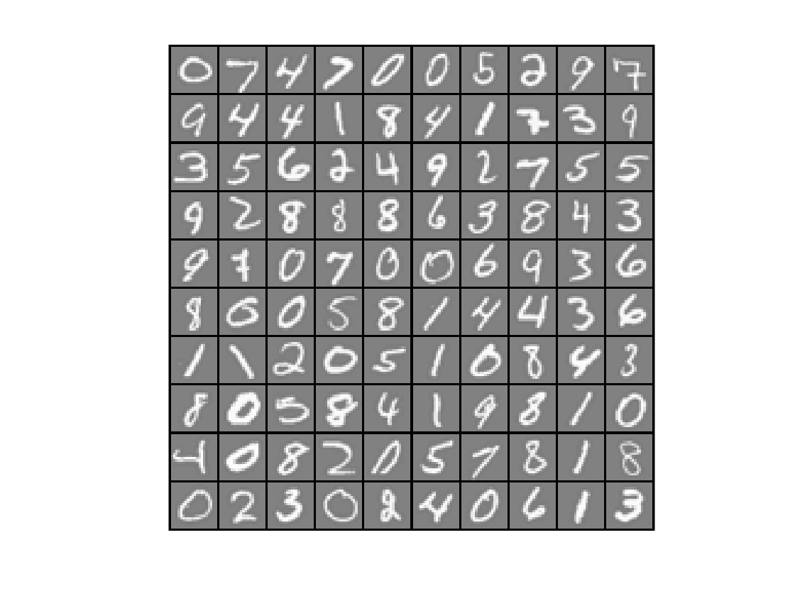

# Hand-written-digit-recognizer-MATLAB
This project was done as a course project.
In this project, one-vs-all logistic regression classifiers are used to recognize hand-written digits.

A sample visualization of hand-written digits can also be found.

